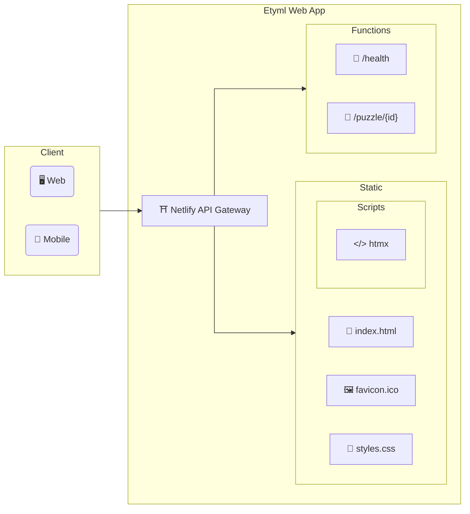

# Etyml

## Web Application Architecture

```mermaid
%%{ init : { "flowchart" : { "curve" : "stepBefore" }}}%%

flowchart LR
    subgraph Client
        direction LR
        Web(🖥️ Web)
        Mobile(📱 Mobile)
    end
    subgraph Etyml Web App
        Netlify[⛩️ Netlify API Gateway]
        subgraph Static
            direction LR
            index[📄 index.html]
            favicon[🖼️ favicon.ico]
            styles.css[🎨 styles.css]
            subgraph scripts[Scripts]
                htmx[&lt;/&gt; htmx]
            end
        end
        subgraph Functions
            direction LR
            health[💓 /health]
            puzzle["🧩 /puzzle/{id}"]
        end
    end

  Client --> Netlify
  Netlify --> Functions
  Netlify --> Static
```
