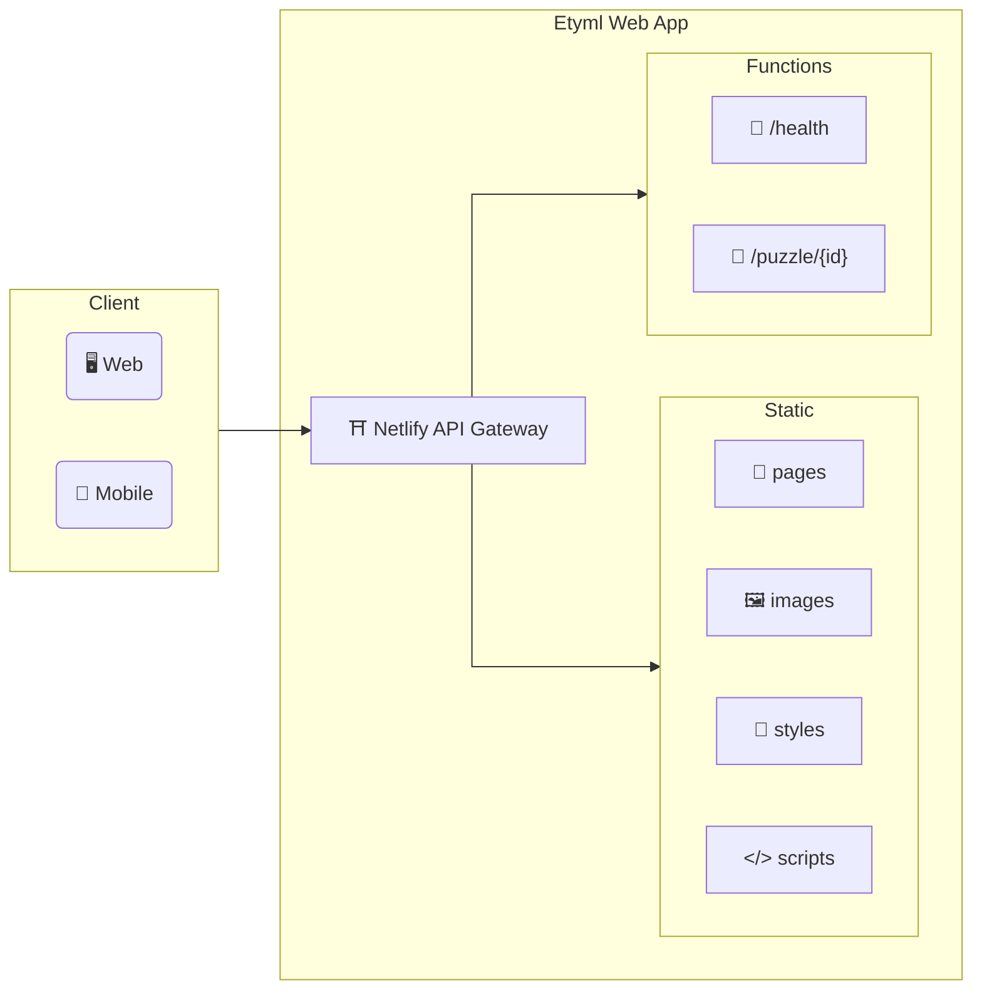

# Etyml

<!-- TODO:
- add more obvious hint tooltip like question mark in a circle or something
- add option to disable hints
- add hints to any non root node with definitions
- add validation for input words
  - no duplicate and must be one of the english words in wiktionary
-->

## Dependencies

- [Go](https://go.dev/)
- [Netlify CLI](https://www.netlify.com/platform/core/cli/)
- [htmx](https://htmx.org/) ([local copy](./web/scripts/htmx@2.0.1-min.js))
  - custom version with fix for [htmx issue #1788](https://github.com/bigskysoftware/htmx/issues/1788)

## Web App Diagram

```mermaid
%%{ init : { "flowchart" : { "curve" : "stepBefore" }}}%%

flowchart LR
    subgraph Client
        direction LR
        Web(🖥️ Web)
        Mobile(📱 Mobile)
    end
    subgraph Etyml Web App
        Netlify[⛩️ Netlify API Gateway]
        subgraph Static
            direction LR
            pages[📄 pages]
            images[🖼️ images]
            styles[🎨 styles]
            scripts[&lt;/&gt; scripts]
        end
        subgraph Functions
            direction LR
            health[💓 /health]
            puzzle["🧩 /puzzle/{id}"]
        end
    end

  Client --> Netlify
  Netlify --> Functions
  Netlify --> Static
```
